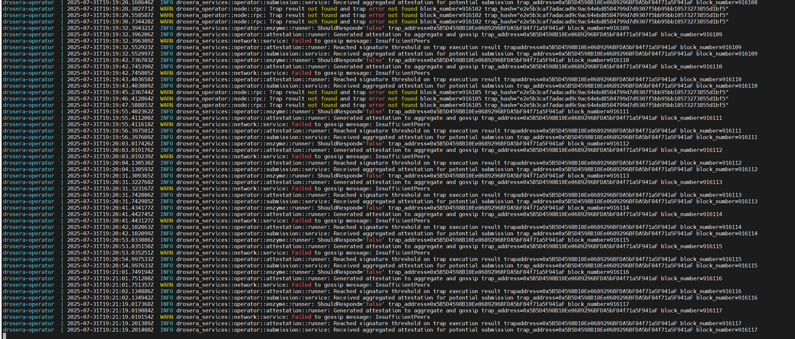
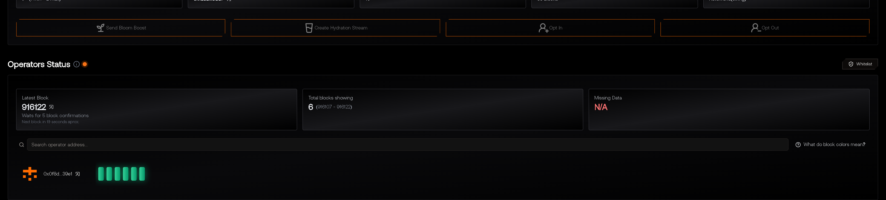

# 🧠 Drosera Operator for Hoodi Network

Operator node for processing "traps" in the **Drosera** network on a chain **Hoodi (Chain ID: 560048)**.  
It automatically reacts to events and generates **attestations** as part of the decentralized execution of smart contracts.

---

## ⚙️ Addresses and parameters used

- Ethereum RPC: `https://ethereum-hoodi-rpc.publicnode.com`
- Drosera RPC: `https://relay.hoodi.drosera.io`
- Chain ID: `560048`
- Trap address: `0x4B8F226bc9c3A9C6b5b6AA9A741173740544F86c`
- Whitelisted operator: `0xC988FC9a1195A391382EC8Ded0ac703cf022408b`

---

## 🚀 Quick start

### 1. Clone a repository

```bash
git clone https://github.com/matsidor1975/drosera-operator.git
cd drosera-operator
```

### 2. Configure Environment Variables

Create a '.env` file or use shell variables:

```env
OPERATOR_PRIVATE_KEY=your_private_key_without_0x
```

### 3. Launching via Docker Compose

```bash
docker compose up --build
```

---

## 📄 Trap Configuration (`drosera.toml`)

```toml
ethereum_rpc = "https://ethereum-hoodi-rpc.publicnode.com"
drosera_rpc = "https://relay.hoodi.drosera.io"
eth_chain_id = 560048
```

---

## 🖼 Скриншоты

| Launch | Successful Attestation|
|--------|----------------------|------------|
|  |  |

---

## 🛠 Useful commands

- Viewing logs:
  ```bash
  docker compose logs -f
  ```

- Restart:
  ```bash
  docker compose down && docker compose up --build
  ```

---

## 📢 Notes

---

## 📜 Лицензия

MIT License. Use it freely, but wisely..
